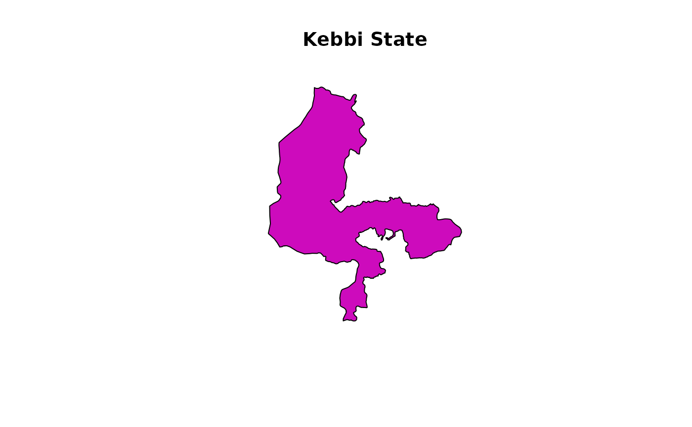

# nigeria-maps

The need for relatively easy-to-use tools in the R statistical
environment for mapping data on Nigeria was a motivation for the
development of this package. Not so much of low-level programming needs
to be done by the user; rather a collection of pre-existing packages and
idioms are brought together to enable a focus on actual data
visualization.

The main function for drawing Nigeria maps is `map_ng`. It uses data
from the CIA World Database provided by the `{mapdata}` package as well
as ESRI shapefiles from the World Bank to draw simple maps of Nigeria.

``` r

library(naijR)

map_ng()
```


To show the map without the state borders, set the first argument
(`region`) to `NULL`. Thus, with all other arguments set to default
values, that would be

``` r

map_ng("Nigeria")
```


All the Local Government Areas can equally be displayed, using a map
that, by default, does not display text, so as to avoid cluttering. This
kind of map is useful for charting choropleth maps, as shown below for
the States. To this, we pass the value produced by
[`lgas()`](https://docs.ropensci.org/naijR/reference/lgas.md).

``` r

map_ng(lgas())
```


It is also possible to make maps of sub-national divisions by defining
them via `region`. For example, `states("sw")` returns a character
vector of the states in the South-West geopolitical zone (see
[`?states`](https://docs.ropensci.org/naijR/reference/states.md)). To
display them on a map with a few embellishments like labelling and
colour, write

``` r

map_ng(states(gpz = "sw"), show.text = TRUE, col = 4)
```


A single state can also be drawn:

``` r

kk <- "Kebbi"
map_ng(kk, col = 6, title = paste(kk, "State"))
```



## Choropleth maps

Choropleth maps that display differences among regions can also be
created with `map_ng`. There are a number of ways this can be done,
depending on the kind of arguments supplied to the function:

- A data frame containing a column for the regions and at least one
  other for the data to be displayed, or
- An atomic vector for the regions and another for the data to be
  displayed.

This map is built on categorical data (i.e. `factor`s); atomic vectors
that are coercible to this class are also accepted. In the case of
numeric data, notably those of type `double`, they can be coaxed into
categories only if class boundaries are provided via the `breaks`
argument.

To demonstrate this, we will create a data frame with some meaningless
data:

``` r

# Create variables
ss <- states()
numStates <- length(ss)
vv <- sample(LETTERS[1:5], numStates, TRUE)

# Create a data frame and view top rows
dd <- data.frame(state = ss, letter = vv)
head(dd)
#>       state letter
#> 1      Abia      E
#> 2   Adamawa      D
#> 3 Akwa Ibom      E
#> 4   Anambra      D
#> 5    Bauchi      A
#> 6   Bayelsa      E
```

### Using a data frame

The easiest way to draw the choropleth map is to pass a two-column data
frame to the `data` argument. Thus if the data frame has more columns,
it is trivial to subset it and extract the 2 columns of interest.
Continuing with our example,

``` r

map_ng(data = dd)
```


Note the following:

- The argument `var` is the name of the column of our data frame that
  has the variable to be mapped. It is found via the mechanism called
  *quasiquotation*; to explore this further see
  [`?rlang::quasiquotation`](https://rlang.r-lib.org/reference/topic-inject.html).
- The colours darken sequentially from A through E and it follows the
  natural (alphabetical) ordering of the factor levels (i.e. category
  labels). To control this order upfront, create an **ordered factor**
  using any the various ways available in R. (See
  [`?ordered`](https://rdrr.io/r/base/factor.html))
- Our variable `var` is actually a character vector, but internally is
  converted to a factor.

### Using atomic vectors

We can use the same data to make the same map, but with a different
coding approach:

``` r

map_ng(region = states(), x = vv, col = "red", show.text = FALSE)
```


It’s exactly same map as before, but this time, we used 2 vectors to
provide the data – one for the regions (in this case the 36 States and
FCT) and another for the categorization. We have also introduced some
colouring with the `col` argument. Although it has the same data, if we
try to use the column name from `dd`, we have an error.

``` r

map_ng(region = states(), x = var)
#> Error in `.prep_choropleth_opts()`:
#> ! One or more inputs for generating choropleth options are invalid
```

### Numerical values

When the data to be categorized are `numeric` vectors, the categories
have to be defined. To achieve this, the `breaks` argument has to be
supplied. This is a numeric vector that describes class limits for
grouping the values. The number of classes is `length(breaks) - 1`.

``` r

nn <- runif(numStates, max = 100)  # random real numbers ranging from 0 - 100
bb <- c(0, 40, 60, 100)

map_ng(
  region = states(),
  x = nn,
  breaks = bb,
  col = 'YlOrRd',
  show.text = FALSE
)
```


To get a more meaningful and interpretable legend, use the `categories`
argument.

``` r

map_ng(
  region = states(),
  x = nn,
  breaks = bb,
  categories = c("Low", "Medium", "High"),
  col = 3L, 
  show.text = FALSE
)
```


Note that various colour arguments have been used, some of them kind of
cryptic. More details on how to use the colouring schemes, check the
help page of
[`?map_ng`](https://docs.ropensci.org/naijR/reference/map_ng.md).

## Mapping of point data

To show the distribution of point data on any the maps such as GIS
location data, a different set of arguments is employed. Since point
data requires a pair of coordinates to be accurate, both the `x` and `y`
arguments MUST be provided. Once the function receives both coordinates,
either as separate atomic vectors or as columns from a data frame,
`map_ng` defaults to the mapping of points only in within the boundaries
indicated by `region`. It looks like this:

``` r

x <- c(3.000, 4.000, 6.000, 5.993, 5.444, 6.345, 5.744)
y <- c(8.000, 9.000, 9.300, 10.432, 8.472, 6.889, 9.654)

map_ng("Nigeria", x = x, y = y)
```


The function `map_ng` carries out a bounds check on point data and
returns an error, and the points are not plotted, when the coordinates
are beyond the region. For instance, using the same points provided
earlier, if we try to plot them on a map of Kwara State,

``` r

map_ng("Kwara", x = x, y = y)
```


    #> Error in `map_ng()`:
    #> ! Coordinates are beyond the bounds of the plotted area

## Conclusion

This vignette provided an initial look at the mapping facilities
currently available in the `naijR` package. Additional development is
going on to provide the user with more granular control, as well make
the maps to be extendible by more established geospatial R packages.
